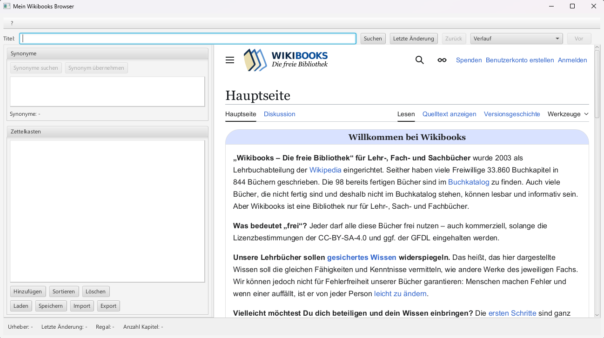
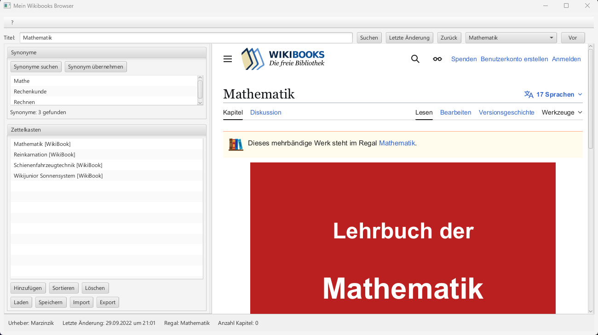

# Wikibooks Browser

A JavaFX desktop application for browsing and managing media from [Wikibooks](https://de.wikibooks.org). Built as a university project demonstrating API integration, XML/JSON parsing, multiple persistence strategies, and a clean MVC architecture.

## Screenshots

| Initial Start | Search with Example |
|-------|----------------------|
|  |  |

## Features

- **Integrated Browser** – Renders live Wikibooks pages via JavaFX WebView
- **Metadata Extraction** – Automatically fetches author, last edit date, shelf category, and chapter count by parsing the Wikibooks XML export with a SAX parser
- **Redirect Handling** – Transparently resolves Wikibooks redirects (up to 5 levels deep)
- **Navigation History** – Back/forward navigation with dropdown history
- **Synonym Search** – Queries the [OpenThesaurus API](https://www.openthesaurus.de) (JSON/Gson) and allows using synonyms as new search terms
- **Media Management (Zettelkasten)** – Save, sort, and delete media entries including WikiBooks, Books, CDs, Journals, and Electronic Media
- **Multiple Persistence Strategies**
  - Binary serialization (`.dat`)
  - BibTeX import/export (`.bib`)
  - Human-readable text export (`.txt`)
- **ISBN Validation** – Validates ISBN-10 (Modulo-11) and ISBN-13 (Modulo-10)
- **URL Validation** – Validates URLs before storing electronic media

## Tech Stack

| Technology | Usage |
|---|---|
| Java 21 | Core language |
| JavaFX 21.0.6 | GUI (WebView, FXML, MVC) |
| Gson 2.10.1 | JSON parsing (OpenThesaurus API) |
| SAX Parser | XML parsing (Wikibooks Export API) |
| JUnit 5.12.1 | Unit tests |
| Maven 3.9.11 | Build & dependency management |

## Project Structure

```
src/
├── main/java/application/wikibooks_browser/
│   ├── Launcher.java                  # Application entry point
│   ├── Main.java                      # JavaFX entry point
│   ├── WikiBooksController.java       # UI controller (MVC)
│   ├── WikiBooks.java                 # Wikibooks XML export & metadata parsing
│   ├── WikiExportSaxHandler.java      # SAX parser for XML export
│   ├── WikiBook.java                  # WikiBook model
│   ├── OpenThesaurusSynonyme.java     # Synonym API integration
│   ├── Zettelkasten.java              # Media collection manager
│   ├── Medium.java                    # Abstract base class
│   ├── Buch.java                      # Book subclass
│   ├── CD.java                        # CD subclass
│   ├── Zeitschrift.java               # Journal subclass
│   ├── ElektronischesMedium.java      # Electronic media subclass
│   ├── MediumStatus.java              # Enum: VERFUEGBAR / AUSGELIEHEN
│   ├── Persistency.java               # Persistence interface
│   ├── BinaryPersistency.java         # Binary serialization
│   ├── BibTexPersistency.java         # BibTeX import/export
│   ├── HumanReadablePersistency.java  # Text export
│   ├── MyWebException.java            # Exception for web access errors
│   ├── DuplicateEntryException.java   # Exception for duplicate media titles
│   └── Pruefroutine.java              # ISBN & URL validation
└── test/java/application/wikibooks_browser/
    ├── PruefroutineTest.java
    ├── BibTexPersistencyTest.java
    └── ZettelkastenTest.java
```

## Getting Started

### Prerequisites

- Java 21+
- Maven 3.8+

### Run

```bash
git clone https://github.com/niklashoelzl/Wikibooks-Browser
cd Wikibooks-Browser
mvn javafx:run
```

### Run Tests

```bash
mvn test
```

## Architecture

The application follows the **MVC pattern**:
- **Model** – `Zettelkasten`, `Medium` hierarchy, persistence classes
- **View** – `View.fxml` (JavaFX FXML layout)
- **Controller** – `WikiBooksController.java`

The `Persistency` interface allows swapping persistence strategies at runtime. `HumanReadablePersistency` intentionally only supports saving (the `load()` default in the interface throws `UnsupportedOperationException`).

## License

This project is for educational purposes only. All content fetched from Wikibooks is licensed under [CC-BY-SA 3.0](https://creativecommons.org/licenses/by-sa/3.0/). App icon by [Wikimedia Commons](https://commons.wikimedia.org/wiki/File:Stacked_books_icon.svg), licensed under CC0.
